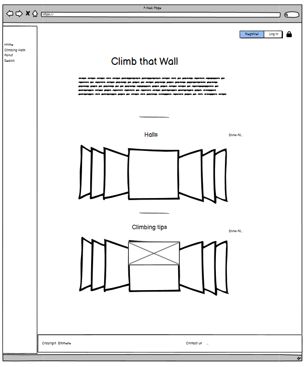
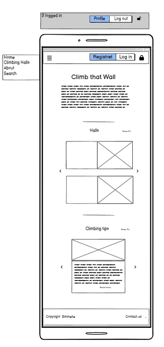
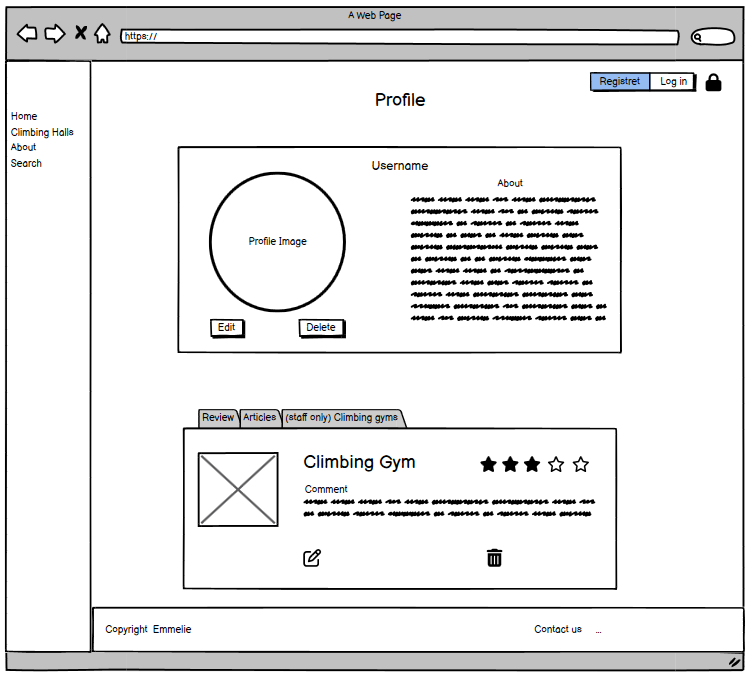
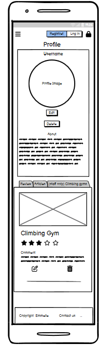
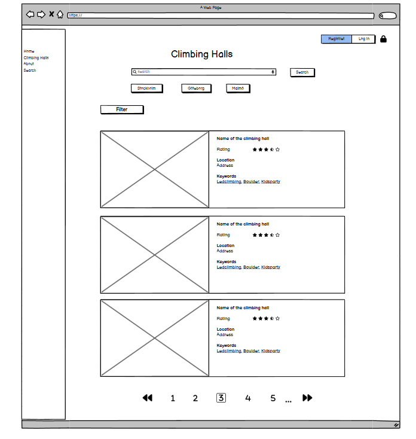
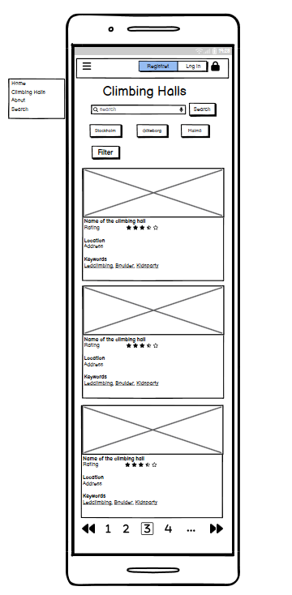
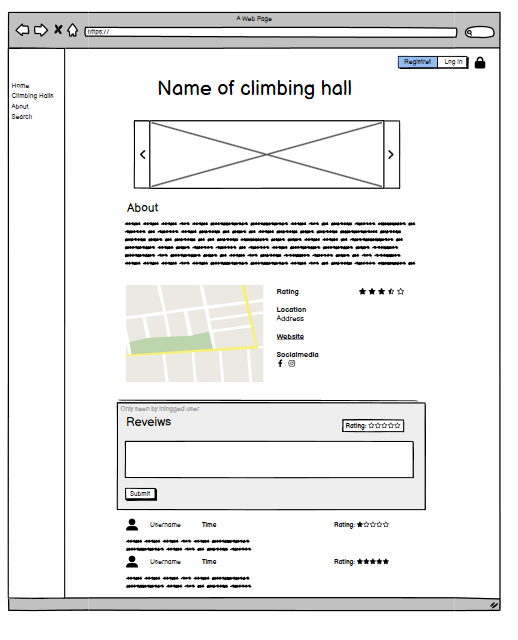
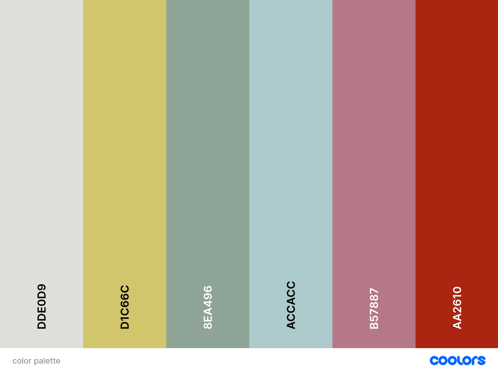

# Climb that Wall

## Introduction

Welcome to your ultimate guide, Climb That Wall, for discovering climbing gyms in new cities with ease! Climb That Wall is able to help you effortlessly find top-notch climbing gyms, no matter where you are. Our user-friendly search function allows you to locate gyms that perfectly match your climbing style and preferences.

The website is fully responsive, ensuring a seamless experience on all modern screen sizes. You can easily add, edit, or delete your profiles, and share reviews of the climbing gyms you've visited. Plus, the site owner and staff can create new gym pages and update their details to keep the information fresh and accurate.

The site is built using HTML, CSS, Bootstrap, JavaScript, Python, and Django, Climb That Wall uses a PostgreSQL database through Code Institute to bring you the best climbing gym discovery experience.

Veiw the live site here: [Climb That Wall](https://climb-that-wall-e398d1e902cb.herokuapp.com/)

For Admin access with relevant sign-in information: [Climb That Wall Admin](https://climb-that-wall-e398d1e902cb.herokuapp.com/admin)  

## Table of Content

## Overview

Climb That Wall is a Website for discovering climbing gyms in new cities. Users are invited to:

- Join the Climb That Wall Website
- Create their own profiles
- Update their Profiles
(- Save there favorite Climbing gym)
- Interact with Website Climbing gyms
- Share their experiece at the Climbing gym by leaving a review
- Create a staff account
- Update thier own climbing gyms

# User experience

## User Goals

I am passionate about climbing and find it challenging to locate climbing centers while traveling or in a new city. This website, Climb That Wall, will help you easily find a Climbing Gym without extensive searching. Whether you are a passionate climber exploring a new place or a local looking for the best climbing spots, Climb That Wall is here to simplify your search for a climbing gym. The website is designed to help you locate the best climbing gyms wherever you are.

### Features for Users

**_Discover Gyms:_** \
Easily search for climbing gyms in any city. Our extensive listings include details about the gyms' facilities and more.\
**_User Reviews:_**\
Get insights from fellow climbers by reading reviews. Share your own experiences to help others find the best spots to climb.\
**_Personalized Accounts:_** \
Sign in to save your favorite gyms, track the ones you've visited, and leave reviews.

### Features for Gym Owners

**_Create a Gym Page:_** \
If you own or manage a climbing gym, you can create and manage a page for your gym. This ensures climbers can find your facility easily and get all the information they need.\
**_Engage with Climbers:_**\
 Update your gym's information, and showcase what makes your climbing gym unique.

## User  Stories

### Epics

The project was organized into distinct epics, each encompassing potential project features. These epics were then broken down into individual user stories, each designed to deliver specific value to the user. These user stories were developed from the viewpoints of website users, climbing gym owners, and the website owner.

### User Stories

All the user stories are added as issues on GitHub.
Each user story details the value it provides, the acceptance criteria required for completion, and the tasks needed to complete it. \
You can find all User Stories in the [Github Project Board](https://github.com/users/Ko11e/projects/3/views/1)

## Planing

## Structure

### Database

### Wifeframe

I used [Balsamiq](https://balsamiq.com/) to create wireframes for 'Climb That Wall' in order to plan the content flow and styling. Although there are some differences between the original wireframes and the final product, these variances are the result of design decisions made during the creative process.

#### Home page

#### Profile

#### Search for climbing gym

#### Detail information about a climbing gym

## Design Choices

### Color Scheme

The color palette have been collected from the origal background image. However, the background on the website has a filter with a soft Off-White pick from the image in this [link](docs/images/Background-before-after.png) can the before and after be seen. For the background image is this color palette carefully chosen to create a harmonious balance between tranquility and energy. The combination of soft neutrals and muted tones, punctuated by vibrant and warm hues, ensures a versatile and visually engaging design. Each color has been selected to complement and enhance the others, resulting in a cohesive and aesthetically pleasing ensemble.

### Fonts

## Features

### Home Page

### Search View

### Climbing gym Detail page

#### Create/Edit Climbing gym

### Contact Form

### Footer

### Futuer Features

## Technologies Used

## Packages and Libraries

## Testing

The testing documentation for this project is available in another document. To access information about the testing, please click on the following link: [TESTING.md](/TESTING.md)

## Deployment

## Credits
