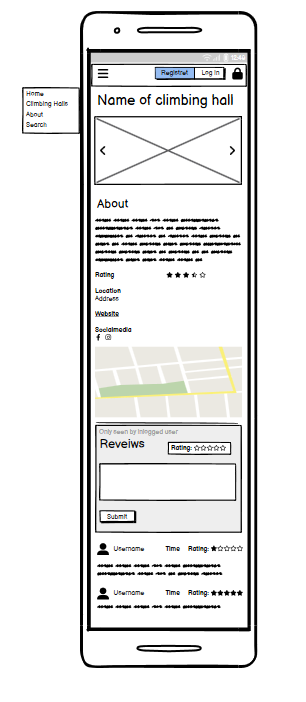

# Climb that Wall


## Introduction

Welcome to your ultimate guide, Climb That Wall, for discovering climbing gyms in new cities with ease! Climb That Wall is able to help you effortlessly find top-notch climbing gyms, no matter where you are. Our user-friendly search function allows you to locate gyms that perfectly match your climbing style and preferences.

The website is fully responsive, ensuring a seamless experience on all modern screen sizes. You can easily add, edit, or delete your profiles, and share reviews of the climbing gyms you've visited. Plus, the site owner and staff can create new gym pages and update their details to keep the information fresh and accurate.

The site is built using HTML, CSS, Bootstrap, JavaScript, Python, and Django, Climb That Wall uses a PostgreSQL database through Code Institute to bring you the best climbing gym discovery experience.

Veiw the live site here: [Climb That Wall](https://climb-that-wall-e398d1e902cb.herokuapp.com/)

For Admin access with relevant sign-in information: [Climb That Wall Admin](https://climb-that-wall-e398d1e902cb.herokuapp.com/admin)  

## Table of Content

## Overview

Climb That Wall is a Website for discovering climbing gyms in new cities. Users are invited to:

- Join the Climb That Wall Website
- Create their own profiles
- Update their Profiles
(- Save there favorite Climbing gym)
- Interact with Website Climbing gyms
- Share their experiece at the Climbing gym by leaving a review
- Create a staff account
- Update thier own climbing gyms

# User experience

## User Goals

I am passionate about climbing and find it challenging to locate climbing centers while traveling or in a new city. This website, Climb That Wall, will help you easily find a Climbing Gym without extensive searching. Whether you are a passionate climber exploring a new place or a local looking for the best climbing spots, Climb That Wall is here to simplify your search for a climbing gym. The website is designed to help you locate the best climbing gyms wherever you are.

### Features for Users

**_Discover Gyms:_** \
Easily search for climbing gyms in any city. Our extensive listings include details about the gyms' facilities and more.\
**_User Reviews:_**\
Get insights from fellow climbers by reading reviews. Share your own experiences to help others find the best spots to climb.\
**_Personalized Accounts:_** \
Sign in to save your favorite gyms, track the ones you've visited, and leave reviews.

### Features for Gym Owners

**_Create a Gym Page:_** \
If you own or manage a climbing gym, you can create and manage a page for your gym. This ensures climbers can find your facility easily and get all the information they need.\
**_Engage with Climbers:_**\
 Update your gym's information, and showcase what makes your climbing gym unique.

## User  Stories

### Epics

The project was organized into distinct epics, each encompassing potential project features. These epics were then broken down into individual user stories, each designed to deliver specific value to the user. These user stories were developed from the viewpoints of website users, climbing gym owners, and the website owner.

### User Stories

All the user stories are added as issues on GitHub.
Each user story details the value it provides, the acceptance criteria required for completion, and the tasks needed to complete it. \
You can find all User Stories in the [Github Project Board](https://github.com/users/Ko11e/projects/3/views/1)

# Structure

## Agile Development Process

### Agile Methodology

The development of Climb That Wall is guided by Agile principles, which prioritize flexibility, continuous improvement, and rapid adaptation to change. While I do not strictly follow traditional Agile practices such as scheduled sprints or scrums, my process is inspired by Agile methodologies.

Instead of scheduled sprints or scrums, I have set up iterations, but found them hard to follow. Therefore, I have chosen to structure the project around key milestones leading up to the overall deadline. This approach allows me to prioritize the development of core functionalities first, before expanding to more complex features.

I actively seek and analyze user feedback to identify areas for improvement, ensuring that the product continuously evolves to effectively meet user needs and expectations.

For more information, please visit the [GitHub Project Board](https://github.com/users/Ko11e/projects/3/views/1).

### MoSCoW Prioritization

I implemented the MoSCoW Prioritization method for Climb That Wall, systematically identifying and labeling project components to ensure a clear and effective development process:

**_Must Haves_** \
These are the essential, critical components that the project cannot succeed without. This provids early achievement a solid foundation, allowing me to further develop and enhance the project beyond the initial scope.

**_Should Haves_** \
These components are highly valuable and beneficial to the project but are not crucial at the MVP stage. While important, they are secondary to the 'Must Haves' and are prioritized accordingly. Addressing these features comes after the critical components are in place, ensuring the project remains on track and focused.

**_Could Haves_** \
These features are considered enhancements or 'nice-to-haves'. They are not essential for the project's core functionality but add value if included. These components are only addressed once the 'Must Haves' and 'Should Haves' are completed and if time permits.

**_Won't Haves_** \
These are features or components that either do not align with the current project goals or are of very low priority for the current release. By clearly identifying and setting aside these elements, the development process remains focused and efficient, avoiding unnecessary scope creep.

Using the MoSCoW method provided a structured approach to prioritize tasks effectively, ensuring that the most critical components were developed first, leading to a successful and timely project completion.

## Database

The Database schemas were drawn using [dbdiagram.io](https://dbdiagram.io/home). The schemas were used to plan the database models and the apps. The schema was very helpful to get a bigger picture of the structures to create the 6 different models later. 


## Wifeframe

I used [Balsamiq](https://balsamiq.com/) to create wireframes for 'Climb That Wall' in order to plan the content flow and styling. Although there are some differences between the original wireframes and the final product, these variances are the result of design decisions made during the creative process.

### Home page


### Profile


### Search for climbing gym


### Detail information about a climbing gym




## Design Choices

### Color Scheme

The color palette have been collected from the origal background image. However, the background on the website has a filter with a soft Off-White pick from the image in this [link](docs/images/Background-before-after.png) can the before and after be seen. For the background image is this color palette carefully chosen to create a harmonious balance between tranquility and energy. The combination of soft neutrals and muted tones, punctuated by vibrant and warm hues, ensures a versatile and visually engaging design. Each color has been selected to complement and enhance the others, resulting in a cohesive and aesthetically pleasing ensemble.


### Typography

The selected fonts for the website are Amatic SC and Arsenal SC. These fonts is selected to stand out and are only used as headers and in the navbar text.
Amatic SC is seleced because it structure remineds on the structure of the climbing wall or a mountain. The font is also have a unique, eye-catching appearance that draws attention. However, Amatic SC is only use in a first header(h1). Seens Amatic SC is a font with only capitaleze the font for the navbar is also is caitalized to have a cohesive feeling for the website. Making the font for the navbar tp be Arsenal SC.


The rest of the text is decided to be the default from Bootstrap5 as it is easy to read and have a characteristics need for neordivigents to find is easy to read as well.
The mix of fonts creates a clear visual hierarchy. Amatic SC draws attention to primary headings and Arsenal SC ensures functional elements like the navbar are easy to use
By combining decorative and functional fonts, the design achieves a balance between visual interest and usability. This combination helps to convey the desired tone while ensuring readability and navigation efficiency.

## Features

### Home Page

### Search View

### Climbing gym Detail page

#### Create/Edit Climbing gym

### Contact Form

### Footer

### Future Features

As I see it there's a lot of future features that could be added to this website. One of the features that was meant to be implemented was a tips app. In the tips app the user could create tips for training, climbing shoes, rope or harnesses, to be shared to other climbers. This tips could then also be liked and seen on your profile. Below is other features that could be implemented in the future.

- A map section on the climbing gym detail page. This was mean to be implemented but i had a hard time making the API to googlemaps to work.
- As a User i can like my favortie climbing gyms, so that i san find them easy.
- As a staff and the owner of a climbing gym they can also respond to the review that have been made.
- The climbing gym has a event section displaying upcoming events.

- A app to see and get an uppdatet when the world cup starts or send the competion.

## Technologies Used

### Languages Used

- [HTML5](https://developer.mozilla.org/en-US/docs/Web/Guide/HTML/HTML5)
- [CSS3](https://developer.mozilla.org/en-US/docs/Archive/CSS3#:~:text=CSS3%20is%20the%20latest%20evolution,flexible%20box%20or%20grid%20layouts.)
- [JavaScript](https://developer.mozilla.org/en-US/docs/Web/JavaScript)
- [Python](https://www.python.org/) _This project uses Python 3.12.3._

### Workspace

GitPod & [Visual Studio Code](https://code.visualstudio.com/) was used was used as a local IDE workspace to build the site.

### Version Control

- [Git](https://git-scm.com/) was used for version control. The Gitpod and VS Code terminals were utilized to add, commit to Git and pushed to GitHub.
- [GitHub](https://github.com/) is used to store the code for this project.

### Wireframing

[Balsamiq](https://balsamiq.com/) was used for creating wireframes to plan the layout and structure of the site

### Responsive Design

- [Am I Responsive Design](http://ami.responsivedesign.is/#) was used to check the site's responsive design and create the final site image.
- [Responsinator](http://www.responsinator.com/) was used to improve the site's responsive design on a variety of devices.

### Site Design

- [Font Awesome](https://fontawesome.com/) was used on all pages to add icons
- [Google Fonts](https://fonts.google.com/) was used to select the fonts for the site.
- [favicon.io](https://favicon.io/) was used to create the site favicon.
- [TinyPNG](https://tinypng.com/) was used to compress images.
- [Coolors](https://coolors.co/) was used to create the site color palette.

## Packages and Libraries

### Packages

| Name                | Purpose                  |
| ------------------- | ------------------------ |
| Django              | Framework                |
| django-allauth      | Authentication           |
| django-crispy-forms | Front End Form Rendering |
| dj-database-url     | Database Configuration   |
| gunicorn            | WSGI HTTP Server         |
| Cloudinairy         | Cloud storage for media files |
| django-cloudinary-storage | Cloud storage for Django|
| psycopg2            | PostgreSQL database adapter |
| whitenoise          | Static file serving for WSGI applications |

[View the complete package list for the project here](./requirements.txt)

## Testing

The testing documentation for this project is available in another document. To access information about the testing, please click on the following link: [TESTING.md](/TESTING.md)

## Deployment

### Pre-deloyment

<details>
    <summary>Instruction</summary>
Ensure that Python and pip (Python's package installer) are installed on your system. These tools are necessary for setting up the local development environment. The process works as follows:

- Ensure [Python](https://www.python.org/) is installed on your system.
- Verify that Python is installed on your system by checking its version. This can be done through a command in the terminal `python --version` or by running a small piece of Python code that outputs the version information.
- For installing libraries and modules, use `pip` or `pip3` depending on your Python version.

Important points for before deployment:

- The requirements for the project were added to a requirements.txt file using the command 'pip3 freeze > requirements.txt' in the terminal.
- In .gitignore, include env.py to ensure sensitive information is not pushed to GitHub. 
- In settings.py, link SECRET_KEY to the env.py file where the secret key variable is defined.
- In settings.py, set 'DEBUG = False' to prevent verbose error pages and to prevent Django serving static files itself instead of relying on Cloudinary.
- It is necessary to make migrations and migrate the models to the database before deployment.

</details>

### Heruko

<details>
<summary>Instructions</summary>

1. **Heroku Account:** \
Make sure you have a Heroku account. If not, sign up on the Heroku website.
2. **GitHub Repository:** \
Ensure your project is hosted on GitHub
3. **Heroku Dashboard:** \
Log in to your Heroku account and go to the Heroku Dashboard.
4. **Create a New App:** \
Click `New` to create a new app. Placed on the upper right side and then select `Create new app`.
5. **App Name:** \
Choose a unique name for your app, (it cannot be the same as this app) and region region, then click `Create app`.
6. **Heroku Postgres** \
Go to Resources Tab, Add-ons, search and add Heroku Postgres
7. **New App** \
From the new app choose **Settings**, navigate to "Config Vars" and click **Reveal Config Vars**, \
Config Vars for development of this project:
    | VALUE |
    |:------------------|
    | CLOUDINARY_URL |
    | DISABLE_COLLECTSTATIC |
    | DATABASE_URL |
    | SECRET_KEY |
    | HOST |


    Config Vars for production remove VALUE = DISABLE_COLLECTSTATIC

    **=> Go back to your code**

8. **Procfile** \
   Add the Procfile to your application's root directory ```echo web: node index.js > Procfile```. Heroku relies on this file to determine how to run your application, ensuring the correct setup of your web server. Use commands like `web: gunicorn PROJ_NAME.wsgi` in the Procfile to instruct Heroku on starting your web server with Gunicorn
9. In settings in your app add Heroku to **ALLOWED_HOSTS**
10. Add and commit the changes in your code and push to github
11. **Add Buildpack** \
    Scroll further down on the page, select **Add Buildpack**. The buildpacks will install further dependencies that are not included in the 'requirements.txt'. \
    It's crucial to arrange the build packs correctly! First, choose Python and then Node.js. If they're not in this sequence, you can reorder them by dragging.
12. **Deploy** \
    From the tab above select the 'deploy section'.

13. **GitHub** \
    For deploying this project, we're using GitHub as our method. After choosing GitHub, make sure to confirm the connection. Then, search for your repository name and once Heroku finds your repository - click "connect"

14. **Choose deploy method**
    1. Scroll down to the section "Automatic Deploys".
    2. Click "Enable automatic deploys" or choose "Deploy branch" and manually deploy.
    3. Click "Deploy branch" wait for the app to be built. Once this is done, a message should appear letting us know that the app was successfully deployed.
    4. Click the button "View" to see the app.

</details>


--------------------

### Forking the GitHub Repository
<details>
    <summary>Instructions</summary>
By forking the GitHub Repository we make a copy of the original repository on our GitHub account to view and/or make changes without affecting the original repository by using the following steps...

1. Log in to GitHub and locate the [GitHub Repository](https://github.com/Ko11e/Climb-that-wall.git)
2. At the top-right corner of the Repository, locate the "**Fork**" Button. Click on the button to make a fork of this repository
3. You should now have a copy of the original repository in your GitHub account.

</details>

------------

### Clone this GitHub Repository
<details>
    <summary>Instructions</summary>
A local clone of this repository can be made on GitHub. Please follow the below steps:

1. Log in to GitHub and locate the [GitHub Repository](https://github.com/Ko11e/Climb-that-wall.git)
2. Above the repository file section, locate the '**Code**' button.
3. Click on this button and choose your clone method from HTTPS, SSH, or GitHub CLI, copy the URL to your clipboard by clicking the '**Copy**' button.
4. Open your Git Bash Terminal.
5. Change the current working directory to the location where you want the cloned directory.
6. Type `git clone`, and then paste the URL you copied earlier.<br>
7. Press **Enter** to create your local clone.
</details>

## Credits

### Code

**Bootstrap**\
Used to styling and make responsive design, ensuring the site's accessibility across various devices. - [Bootstrap documentation](https://getbootstrap.com/).

**Django**\
Django's documentation has been essential for backend development [Django documentation](https://docs.djangoproject.com/en/5.0/).

**django-allauth** \
The setup guidance was followed from both the documentation and tutorials given by Code Institute's PP4 blog walkthrough - [django-allauth](https://docs.allauth.org/en/latest/installation/quickstart.html)

**Sources of inspiration and guidance in general**\
The Django Recipe Sharing Tutorial series by Dee Mc - [Django Recipe Sharing Tutorial series](https://www.youtube.com/@IonaFrisbee).

**Source for the star rating functionn**\
Create Star Rating Input Box using HTML, CSS & JavaScript by [Codingflag](https://www.youtube.com/watch?v=rMR9PsvLFXw)

**Stockoverflow, W3schools, and Geeks for Geeks**\
Code and solutions to bugs that appear under the project were found using Stockoverflow, W3schools, and Geeks for Geeks.

**Code Institute**\
The Django Blog walkthrough acted as a guidance through out this project on how to set up packages and settings.

### Content

#### Images

Most of the images are my own or my friends, otherwise are they taken from [Pexels]
**Navbar**
The image from the navbar is a reconstuation from [Dreamstime](https://www.dreamstime.com/people-climb-rock-black-silhouette-climber-support-partner-wall-vector-man-climbing-activity-motivation-sport-extreme-image212028867)

#### Text Content

Some text have been generated by ChatGPT

### Acknowledgments

- My old **Hackaton** and there amazing support and assistance on Slack.
- Special thanks to **Malin Nilsson**, **Ellenor Vondrus**, and **Patricia Halley** for pushing me when i don't have any motivation.
- My mentor, **Gareth McGirr**, for guiding and supporting me in the right direction.
- My friends and family that i make test and come with feeedback
- My husband for his unwavering support and for handling everything else while I focused on this project.

[Back to the top](#climb-that-wall)
