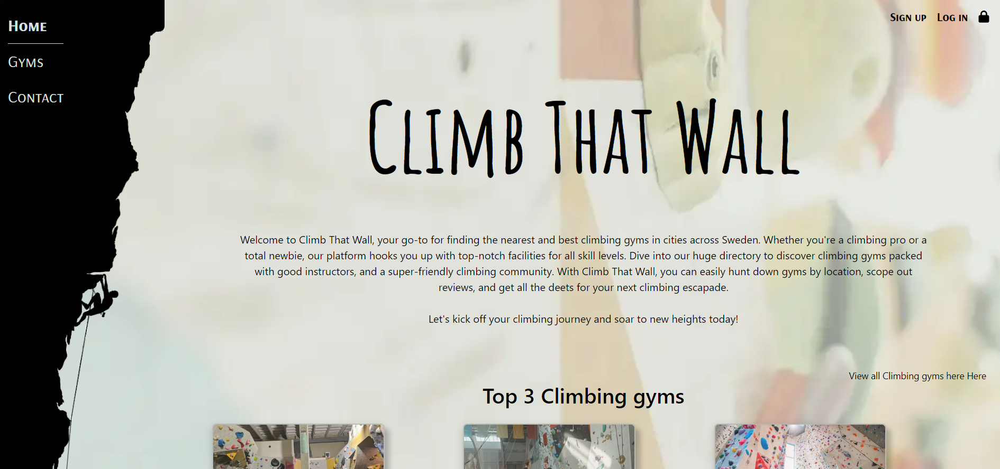

# Climb that Wall


## Introduction

The website "Climb That Wall" is a platform designed to help users find the best climbing gyms across Sweden. It offers a comprehensive directory of climbing facilities, allowing users to search by location, read reviews, and access detailed information about each gym. Whether you're a seasoned climber or a beginner, the site connects you with top-notch gyms that offer skilled instructors and a welcoming community. The website also features a sign-up and login option for personalized experiences and easy access to information.

The website is fully responsive, ensuring a seamless experience on all modern screen sizes. You can easily add, edit, or delete your profiles, and share reviews of the climbing gyms you've visited. Plus, the site owner and staff can create new gym pages and update their details to keep the information fresh and accurate.

The site is built using HTML, CSS, Bootstrap, JavaScript, Python, and Django, Climb That Wall uses a PostgreSQL database through Code Institute to bring you the best climbing gym discovery experience.

View the live site here: [Climb That Wall](https://climb-that-wall-e398d1e902cb.herokuapp.com/)

For Admin access with relevant sign-in information: [Climb That Wall Admin](https://climb-that-wall-e398d1e902cb.herokuapp.com/admin)  

## Table of Contents

1. [Introduction](#introduction)
2. [Overview](#overview)
3. [User Experience](#user-experience)
4. [User Stories](#user-stories)
5. [Structure](#structure)
   - [Agile Development Process](#agile-development-process)
   - [Database](#database)
   - [Wireframe](#wireframe)
6. [Design Choices](#design-choices)
   - [Color Scheme](#color-scheme)
   - [Typography](#typography)
7. [Features](#features)
   - [Existing Features](#existing-features)
   - [Future Features](#future-features)
8. [Technologies Used](#technologies-used)
9. [Packages and Libraries](#packages-and-libraries)
10. [Testing](#testing)
11. [Deployment](#deployment)
    - [Workspace and application platfrom](#workspace-and-application-platfrom)
    - [Github](#github)
12. [Credits](#credits)

## Overview

Climb That Wall is a Website for discovering climbing gyms in new cities. Users are invited to:

- Join the Climb That Wall Website
- Create a profiles
- Update their Profiles
- Interact with Website Climbing gyms
- Share their experience at the Climbing gym by leaving a review
- Create a staff account
- Update their climbing gyms

# User experience

## User Goals

I am passionate about climbing and find it challenging to locate climbing centers while traveling or in a new city. This website, Climb That Wall will help you easily find a Climbing Gym without extensive searching. Whether you are a passionate climber exploring a new place or a local looking for the best climbing spots, Climb That Wall is here to simplify your search for a climbing gym. The website is designed to help you locate the best climbing gyms wherever you are.

### Features for Users

**_Discover Gyms:_** \
Easily search for climbing gyms in any city. Our extensive listings include details about the gyms' facilities and more.\
**_User Reviews:_**\
Get insights from fellow climbers by reading reviews. Share your own experiences to help others find the best spots to climb.\
**_Personalized Accounts:_** \
Sign in to save your favorite gyms, track the ones you've visited, and leave reviews.

### Features for Gym Owners

**_Create a Gym Page:_** \
If you own or manage a climbing gym, you can create and manage a page for your gym. This ensures climbers can find your facility easily and get all the information they need.\
**_Engage with Climbers:_**\
 Update your gym's information, and showcase what makes your climbing gym unique.

## User Stories

### Epics

The project was organized into distinct epics, each encompassing potential project features. These epics were then broken down into individual user stories, each designed to deliver specific value to the user. These user stories were developed from the viewpoints of website users, climbing gym owners, and the website owner.

### User Story

All the user stories are added as issues on GitHub.
Each user story details the value it provides, the acceptance criteria required for completion, and the tasks needed to complete it. \
You can find all User Stories in the [Github Project Board](https://github.com/users/Ko11e/projects/3/views/1)

# Structure

## Agile Development Process

### Agile Methodology

The development of Climb That Wall is guided by Agile principles, which prioritize flexibility, continuous improvement, and rapid adaptation to change. While I do not strictly follow traditional Agile practices such as scheduled sprints or scrums, my process is inspired by Agile methodologies.

Instead of scheduled sprints or scrums, I have set up iterations but found them hard to follow. Therefore, I have chosen to structure the project around key milestones leading up to the overall deadline. This approach allows me to prioritize the development of core functionalities first, before expanding to more complex features.

I actively seek and analyze user feedback to identify areas for improvement, ensuring that the product continuously evolves to effectively meet user needs and expectations.

For more information, please visit the [GitHub Project Board](https://github.com/users/Ko11e/projects/3/views/1).

### MoSCoW Prioritization

I implemented the MoSCoW Prioritization method for Climb That Wall, systematically identifying and labeling project components to ensure a clear and effective development process:

**_Must Haves_** \
These are the essential, critical components that the project cannot succeed without. This provides early achievement a solid foundation, allowing me to further develop and enhance the project beyond the initial scope.

**_Should Haves_** \
These components are highly valuable and beneficial to the project but are not crucial at the MVP stage. While important, they are secondary to the 'Must Haves' and are prioritized accordingly. Addressing these features comes after the critical components are in place, ensuring the project remains on track and focused.

**_Could Haves_** \
These features are considered enhancements or 'nice-to-haves'. They are not essential for the project's core functionality but add value if included. These components are only addressed once the 'Must Haves' and 'Should Haves' are completed and if time permits.

**_Won't Haves_** \
These are features or components that either do not align with the current project goals or are of very low priority for the current release. By clearly identifying and setting aside these elements, the development process remains focused and efficient, avoiding unnecessary scope creep.

Using the MoSCoW method provided a structured approach to prioritize tasks effectively, ensuring that the most critical components were developed first, leading to a successful and timely project completion.

## Database

The Database schemas were drawn using [dbdiagram.io](https://dbdiagram.io/home). The schemas were used to plan the database models and the apps. The schema was very helpful to get a bigger picture of the structures to create the 6 different models later.


## Wireframe

I used [Balsamiq](https://balsamiq.com/) to create wireframes for 'Climb That Wall' in order to plan the content flow and styling. Although there are some differences between the original wireframes and the final product, these variances are the result of design decisions made during the creative process.

### Home page


### Profiles


### Search for climbing gym


### Detail information about a climbing gym


# Design Choices

## Color Scheme

The color palette has been collected from the original background image. However, the background on the website has a filter with a soft Off-White pick from the image in this [link](docs/images/Background-before-after.png) can the before and after be seen. For the background image is this color palette carefully chosen to create a harmonious balance between tranquility and energy. The combination of soft neutrals and muted tones, punctuated by vibrant and warm hues, ensures a versatile and visually engaging design. Each color has been selected to complement and enhance the others, resulting in a cohesive and aesthetically pleasing ensemble.


## Typography

The selected fonts for the website are Amatic SC and Arsenal SC. These fonts are selected to stand out and are only used as headers and in the navbar text.
Amatic SC is selected because its structure reminds of the structure of a climbing wall or a mountain. The font also has a unique, eye-catching appearance that draws attention. However, Amatic SC is only used in the first header(h1). Since Amatic SC is a font with only capitalized the font for the navbar is also capitalized to have a cohesive feeling for the website. Making the font for the navbar to be Arsenal SC.


The rest of the text is decided to be the default font from Bootstrap5 as it is easy to read and has characteristics needed for neurodivergent to find is easy to read as well.
The mix of fonts creates a clear visual hierarchy. Amatic SC draws attention to primary headings and Arsenal SC ensures functional elements like the navbar are easy to use
By combining decorative and functional fonts, the design achieves a balance between visual interest and usability. This combination helps to convey the desired tone while ensuring readability and navigation efficiency.

# Features

## Existing Features

### Home Page

#### Hero section

The main purpose of the home page and the hero section is to be eye-catching and allow the user to easily get a quick understanding of what the website is about. This is achieved by a background image that connects to the website content, and also by having the main navbar placed on the left-hand side instead of on the top to reflect the content more about the navbar in the next section.
The user is greeted by the name of the website a short text about the website, and an image of the hero is presented underneath.



### Navbar

The website's content focuses on climbing gyms and climbing, so the navbar is located on the left-hand side with a background of a silhouette of a lead climber. The intention was for the navbar's background to display the entire image, including the silhouette of the person securing the climber (refer to the first image). However, achieving this was challenging due to the varying heights of the different pages, though it has been successful on some pages or screen sizes. Additionally, the navbar is designed to appear as an offcanvas when accessed from a mobile or small tablet (refer to the second image), allowing the entire background image to be displayed.


#### Signin links

The navbar is positioned on the left-hand side, and it becomes an offcanvas navbar on smaller screens. The Sign-in and Sign-out options are therefore located in the right corner of the screen, indicating whether the user is logged in or not by displaying the username of the logged-in user. Additionally, it shows if you are on your profile with a small line. See the images below for reference.

Non-sign in user:\


Sign-in user:\


Sign-in user on page profile:\


### Footer

The footer allows the user to navigate to the website's social media.
<details>
    <summary>Image of the footer</summary>


</details>

### Sign in/sign up Page

When not logged in, users can easily access the sign-up and sign-in page through the links in the right-hand corner. The sign-up page for Climb That Wall uses a customized template from the Django Allauth package, which handles user authentication. While Allauth provides the core functionality, the template has been extensively modified and styled to align perfectly with the site's unique design. The sign-up page includes a prominent title and a user-friendly form with fields for user input, which also serves as the sign-in page. After successful registration or signing in, users are automatically redirected to the homepage, logged in, and ready to explore the site.


<details>
    <summary>Sign in page</summary>

 

</details>

### Profile
The profile page on the Climb that Wall website serves as a personalized hub for each user, allowing them to manage their account, and showcase their reviews, and if the user is registered as a staff they can see and manage their registered climbing gyms. Here's an overview of the key features and components of the profile page:


**Profile Picture and Username:**\
The top section of the profile page prominently displays the user's username, making it easy for others to identify whose profile they are viewing. Below the username, a profile picture, and about text provide additional context, helping other users connect with the profile owner.

- *Bio:*\
 In addition to the profile picture and username, users can add a bio to share more about themselves with the community. This section provides an opportunity to express interests, preferences, and any other details they wish to share.

- *Favorite Type of Climbing:*\
 Here, the user can select their favorite type of climbing from the available options: Boulder, Lead, Speed, or Outdoors.

- *Edit/Delete Profile:*\
 Users can easily edit their profile information directly from the profile page, including updating their profile picture, editing their bio, and selecting their favorite type of climbing.\
Additionally, they have the option to delete their account if desired.

**Reviews/Climbing gyms**\
The profile page showcases the user's reviews of various climbing gyms on the website. For staff members, it also highlights the climbing gyms they have created. Users can easily browse their reviews and see their contributions to the community. Additionally, this section allows users to edit or delete their reviews and climbing gyms and create climbing gyms.

<details>
<summary>Image of the edit and delete function</summary>

- Reveiws\

- Climbing gyms\

- Create a Climbing gym\


</details>

### Search View

The search functionality on the website allows users to easily find climbing gyms by entering keywords related to descriptions, gym names, or locations. Users can simply type their desired keywords into the search bar and press 'Search' to view relevant climbing gyms that match their criteria.

In addition to keyword searches, the website offers quick search options for preset cities like Stockholm, Gothenburg, and Malmö, the largest cities in Sweden. Users can also filter climbing gyms by rating, and alphabetical order (A to Z or Z to A).

While the intention was to enable users to combine keyword searches with filters for a more comprehensive and customizable experience, this feature is not currently available.

Nevertheless, whether users are searching for a specific climbing gym or exploring new options, the search functionality provides a convenient and user-friendly way to discover climbing gyms in the database.


### Climbing gym Detail page

The full climbing gym details page is a template used to display the full information about a climbing gym. Each published climbing gym has a climbing gym details page. These pages are available for all users to view, including non-logged-in users. The main purpose of the page is to display the full information about the climbing gym. Users will generally navigate to a full climbing gym page by clicking the button on the climbing gym card either on the search page or the home page where the top three climbing gyms are presented.


#### Create Climbing gym

The climbing gym page template is a page that features a climbing gym form to enable users to create a climbing gym on the website. The page isn't viewable by unauthenticated or non-staff users so they have to log in first. The page features similar styling to the rest of the site for consistency, and the header and footer nav menus are present for easy user navigation.


#### Edit Climbing gym

This page allows users who created the climbing gym to update the text content, such as the gym's name, address, and other relevant information, and also add or change images or social media links including websites, Facebook, and others. This feature ensures that the gym's profile remains accurate. The page is straightforward, with fields for each piece of data that can be edited and saved. This feature is particularly useful for gym owners or administrators who need to keep their facility's information current for the community.


#### Review

At the bottom of each climbing gym details page, there's a review section where logged-in users can post their feedback. The reviews are displayed in reverse chronological order, with the most recent at the top. Each review includes the author's username, profile photo, date, and the review content. While non-logged-in users can view the reviews, they cannot access the profiles of the reviewers or leave a review themselves.


### Contact Form

This page offers a simple and direct way for users to get in touch with the site administrators. It features a form where users can enter their names, select a topic (such as general inquiries, bug reports, or staff requests), and submit a message via email. The page emphasizes quick responses and is designed to help users with various concerns, including those interested in adding their climbing gym.


### Page - 401, 403, 404 and 500

The error page is automatically triggered when a user navigates to a site URL that doesn't exist(Error 404), is not authorized(Error 401/403), or Internal Server Error(Error 500). This could be because of several reasons, including a faulty link or an expired URL. Most users will not see this page, but it is there as a backup for users who encounter these rare errors. The purpose of the error pages is to notify the user that there has been an error. The Error pages provide a button link to the homepage for the user to easily navigate back home.


## Future Features

As I see it there's a lot of future features that could be added to this website. One of the features that was meant to be implemented was a tips app. In the tips app, the user could create tips for training, climbing shoes, rope, or harnesses, to be shared with other climbers. These tips could then also be liked and seen on your profile. Below are other features that could be implemented in the future.

- A map section on the climbing gym detail page. This was meant to be implemented but I had a hard time making the API to Googlemaps to work.
- Be able to reset password or change password
- As a User, I can like my favorite climbing gyms, so that I can find them easily.
- As a staff user and the owner of a climbing gym they can also respond to the reviews that have been made.
- The climbing gym has an event section displaying upcoming events.

# Technologies Used

## Languages Used

- [HTML5](https://developer.mozilla.org/en-US/docs/Web/Guide/HTML/HTML5)
- [CSS3](https://developer.mozilla.org/en-US/docs/Archive/CSS3#:~:text=CSS3%20is%20the%20latest%20evolution,flexible%20box%20or%20grid%20layouts.)
- [JavaScript](https://developer.mozilla.org/en-US/docs/Web/JavaScript)
- [Python](https://www.python.org/) _This project uses Python 3.12.3._

## Workspace

GitPod & [Visual Studio Code](https://code.visualstudio.com/) was used as a local IDE workspace to build the site.

## Version Control

- [Git](https://git-scm.com/) was used for version control. The Gitpod and VS Code terminals were utilized to add, commit to Git, and pushed to GitHub.
- [GitHub](https://github.com/) is used to store the code for this project.

## Wireframe and database

**Wireframe**\
[Balsamiq](https://balsamiq.com/) was used for creating wireframes to plan the layout and structure of the site

**Database**\
The structure of the database was created using [dbdiagram.io](https://dbdiagram.io/home)

## Responsive Design

- [Am I Responsive Design](http://ami.responsivedesign.is/#) was used to check the site's responsive design and create the final site image.
- [Responsinator](http://www.responsinator.com/) was used to improve the site's responsive design on a variety of devices.

## Site Design

- [Font Awesome](https://fontawesome.com/) was used on all pages to add icons
- [Google Fonts](https://fonts.google.com/) was used to select the fonts for the site.
- [favicon.io](https://favicon.io/) was used to create the site favicon.
- [TinyPNG](https://tinypng.com/) was used to compress images.
- [Coolors](https://coolors.co/) was used to create the site color palette.

# Packages and Libraries

## Packages

| Name                | Purpose                  |
| ------------------- | ------------------------ |
| Django              | Framework                |
| django-allauth      | Authentication           |
| django-crispy-forms | Front End Form Rendering |
| dj-database-url     | Database Configuration   |
| gunicorn            | WSGI HTTP Server         |
| Cloudinairy         | Cloud storage for media files |
| django-cloudinary-storage | Cloud storage for Django|
| psycopg2            | PostgreSQL database adapter |
| whitenoise          | Static file serving for WSGI applications |

[View the complete package list for the project here](./requirements.txt)

# Testing

The testing documentation for this project is available in another document. To access information about the testing, please click on the following link: [TESTING.md](/TESTING.md)

# Deployment

## Workspace and Application Platform

### Pre-deployment

<details><summary>Instruction</summary>
Ensure that Python and pip (Python's package installer) are installed on your system. These tools are necessary for setting up the local development environment. The process works as follows:

- Ensure [Python](https://www.python.org/) is installed on your system.
- Verify that Python is installed on your system by checking its version. This can be done through a command in the terminal `python --version` or by running a small piece of Python code that outputs the version information.
- For installing libraries and modules, use `pip` or `pip3` depending on your Python version.

Important points for before deployment:

- The requirements for the project were added to a requirements.txt file using the command 'pip3 freeze > requirements.txt' in the terminal.
- In .gitignore, include env.py to ensure sensitive information is not pushed to GitHub.
- In settings.py, link SECRET_KEY to the env.py file where the secret key variable is defined.
- In settings.py, set 'DEBUG = False' to prevent verbose error pages and to prevent Django serving static files itself instead of relying on Cloudinary.
- It is necessary to make migrations and migrate the models to the database before deployment.

</details>

### Heruko

<details><summary>Instructions</summary>

1. **Heroku Account:** \
Make sure you have a Heroku account. If not, sign up on the Heroku website.
2. **GitHub Repository:** \
Ensure your project is hosted on GitHub
3. **Heroku Dashboard:** \
Log in to your Heroku account and go to the Heroku Dashboard.
4. **Create a New App:** \
Click `New` to create a new app. Placed on the upper right side and then select `Create new app`.
5. **App Name:** \
Choose a unique name for your app, (it cannot be the same as this app) and region region, then click `Create app`.
6. **Heroku Postgres** \
Go to the Resources Tab, Add-ons, search, and add Heroku Postgres
7. **New App** \
From the new app choose **Settings**, navigate to "Config Vars" and click **Reveal Config Vars**, \
Config Vars for the development of this project:
 | VALUE |
 |:------------------|
 | CLOUDINARY_URL |
 | DISABLE_COLLECTSTATIC |
 | DATABASE_URL |
 | SECRET_KEY |
 | HOST |

 Config Vars for production remove VALUE = DISABLE_COLLECTSTATIC

 **=> Go back to your code**

8. **Procfile** \
 Add the Procfile to your application's root directory ```echo web: node index.js > Procfile```. Heroku relies on this file to determine how to run your application, ensuring the correct setup of your web server. Use commands like `web: gunicorn PROJ_NAME.wsgi` in the Procfile to instruct Heroku on starting your web server with Gunicorn
9. In settings in your app add Heroku to **ALLOWED_HOSTS**
10. Add and commit the changes in your code and push to GitHub
11. **Add Buildpack** \
 Scroll further down on the page, and select **Add Buildpack**. The buildpacks will install further dependencies that are not included in the 'requirements.txt'. \
 It's crucial to arrange the build packs correctly! First, choose Python and then Node.js. If they're not in this sequence, you can reorder them by dragging.
12. **Deploy** \
 From the tab above select the 'deploy section'.

13. **GitHub** \
 For deploying this project, we're using GitHub as our method. After choosing GitHub, make sure to confirm the connection. Then, search for your repository name and once Heroku finds your repository - click "connect"

14. **Choose deploy method**
    1. Scroll down to the section "Automatic Deploys".
    2. Click "Enable automatic deploys" or choose "Deploy branch" and manually deploy.
    3. Click "Deploy branch" and wait for the app to be built. Once this is done, a message should appear letting us know that the app was successfully deployed.
    4. Click the button "View" to see the app.

</details>

## Github

### Forking the GitHub Repository

<details>
    <summary>Instructions</summary>
By forking the GitHub Repository we make a copy of the original repository on our GitHub account to view and/or make changes without affecting the original repository by using the following steps...

1. Log in to GitHub and locate the [GitHub Repository](https://github.com/Ko11e/Climb-that-wall.git)
2. At the top-right corner of the Repository, locate the "**Fork**" Button. Click on the button to make a fork of this repository
3. You should now have a copy of the original repository in your GitHub account.

</details>

### Clone this GitHub Repository

<details>
    <summary>Instructions</summary>
A local clone of this repository can be made on GitHub. Please follow the below steps:

1. Log in to GitHub and locate the [GitHub Repository](https://github.com/Ko11e/Climb-that-wall.git)
2. Above the repository file section, locate the '**Code**' button.
3. Click on this button and choose your clone method from HTTPS, SSH, or GitHub CLI, copy the URL to your clipboard by clicking the '**Copy**' button.
4. Open your Git Bash Terminal.
5. Change the current working directory to the location where you want the cloned directory.
6. Type `git clone`, and then paste the URL you copied earlier.</br>
7. Press **Enter** to create your local clone.

</details>

------------------------------

# Credits

## Code

**Bootstrap**\
Used to styling and make responsive design, ensuring the site's accessibility across various devices. - [Bootstrap documentation](https://getbootstrap.com/).

**Django**\
Django's documentation has been essential for backend development [Django documentation](https://docs.djangoproject.com/en/5.0/).

**django-allauth** \
The setup guidance was followed from both the documentation and tutorials given by Code Institute's PP4 blog walkthrough - [django-allauth](https://docs.allauth.org/en/latest/installation/quickstart.html)

**Sources of inspiration and guidance in general**\
The Django Recipe Sharing Tutorial series by Dee Mc - [Django Recipe Sharing Tutorial series](https://www.youtube.com/@IonaFrisbee).

**Source for the star rating function**\
Create Star Rating Input Box using HTML, CSS & JavaScript by [Codingflag](https://www.youtube.com/watch?v=rMR9PsvLFXw)

**Stockoverflow, W3schools, and Geeks for Geeks**\
Code and solutions to bugs that appear under the project were found using Stockoverflow, W3schools, and Geeks for Geeks.

**Code Institute**\
The Django Blog walkthrough acted as guidance throughout this project on how to set up packages and settings.

## Content

### Images

Most of the images are taken from [Pexels](https://www.pexels.com/) and [iStock](https://www.istockphoto.com/se) otherwise the images are from myself or my friends.

**Navbar**
The image from the navbar is a reconstruction from [Dreamstime](https://www.dreamstime.com/people-climb-rock-black-silhouette-climber-support-partner-wall-vector-man-climbing-activity-motivation-sport-extreme-image212028867)

### Text Content

Some text has been generated by ChatGPT

## Acknowledgments

- My **Slackteam** and their amazing support and assistance.
- Special thanks to **Malin Nilsson**, **Ellenor Vondrus**, and **Patricia Halley** for pushing me when I don't have any motivation.
- My mentor, **Gareth McGirr**, for guiding and supporting me in the right direction.
- My friends and family that I make test the website and come back with feedback
- My husband for his unwavering support and for handling everything else and our family while I focused on this project.

[Back to the top](#climb-that-wall)
