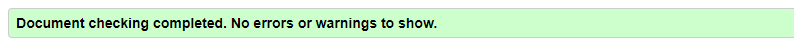
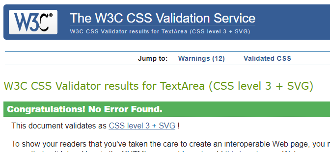
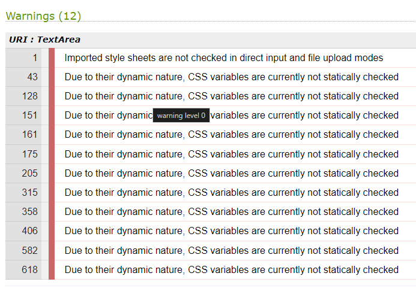
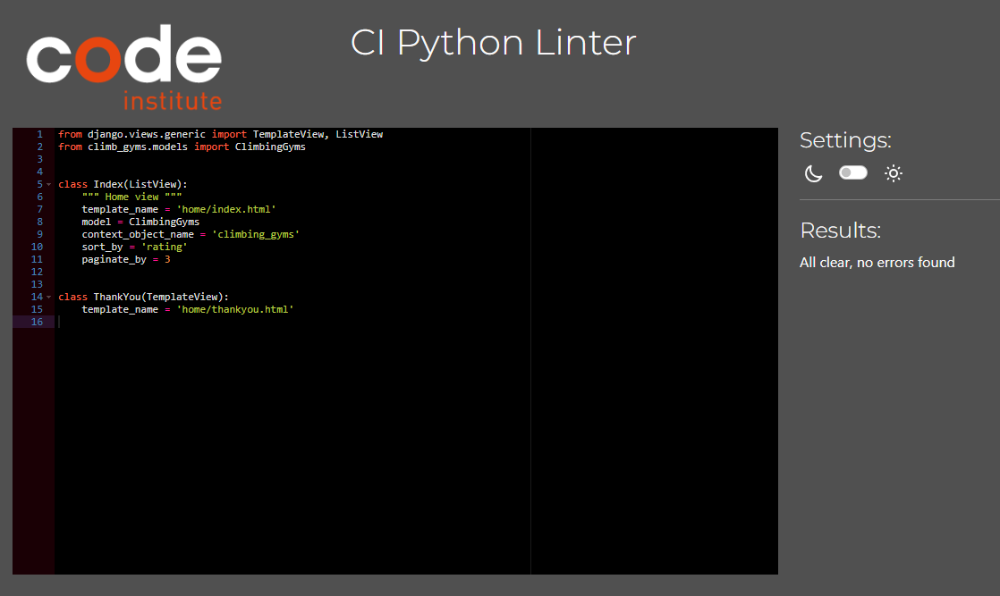
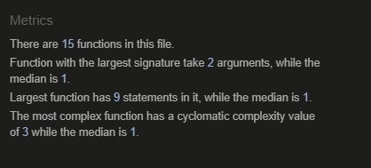
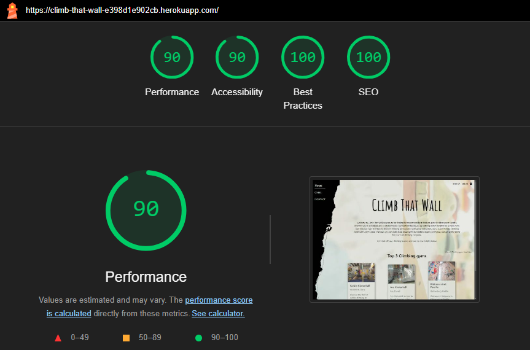

# **Testings**

## **Content**

[Validation](#validation)\
[Manuell testing](#manuell-testing)\
[Bugs](#bugs)

## Validation

Presented underneath are the validation tests that have been done on the website. The images shown are the tests made on the homepage but there is always a link to the rest of the test results from the other tests that have been executed.

### W3C

#### HTML

Errors have been found when validating the HTML code. These errors have been corrected so all the pages passed the validation.

#### CSS

Validated through W3C CSS Validation Service and returns 0 errors and 12 warnings.
However, the larger part of the warnings are on the lines when my :root-values are used.

### PEP8

All code is validated through PEP8 validator and all clear, no errors were found.
Click on the [link](docs/test-images/PEP8) to see the validations

### JSHint

All the JavaScript files have been validated through JSHint and have no error messages.
The results can be seen in the [link](doc/images/JSHint). Shown below is the result from the largest JavaScript file

### Lighthouse

To test the performance, accessibility, best practices, and search engine optimization for the pages of the website Lighthouse has been used.  Most pages scored 90 or over, except for the profile page (score: 89) and the Climbing gym page (score: 82). These lower scores are likely due to performance issues, possibly caused by large or numerous images on the pages. You can view the results from all the tests in this [link](docs/test-images/Lighthouse/).

**[Back to the top](#testings)**

## Manuell Testing

### Home page

| **Test Case ID** | **Description** | **Steps to Execute** | **Expected Result** | **Actual Result** | **Status** |
|------------------|----------------------------------|-----------------------------------------------------------------------------|----------------------------------------------|-------------------------|------------|
| HTC01             | Verify homepage loads            | 1. Open browser 2. Navigate to homepage                                  | Homepage displays correctly                  | Homepage displays correctly | Passed     |
| HTC02             | Verify gym list displays         | 1. Click on "View all" under "Climbing gyms"                                | List of gyms is displayed                    | List of gyms is displayed | Passed     |
| HTC03             | Verify gym details page          | 1. Click on a gym name 2. Check the gym details page                     | Gym details page shows correct information   | Gym details page shows correct information | Passed     |
| HTC04             | Verify signup functionality      | 1. Click "Sign up" 2. Enter details 3. Submit                         | User account created                         | User account created     | Passed     |
| HTC05             | Verify login functionality       | 1. Click "Log in" 2. Enter credentials 3. Submit                      | User is logged in                            | User is logged in        | Passed     |
| HTC06             | Verify contact form submission   | 1. Navigate to "Contact" 2. Fill in the form 3. Submit                | Form submission successful                   | Form submission successful | Passed     |

### Search Climbing gym

| **Test Case ID** | **Description** | **Steps to Execute** | **Expected Result** | **Actual Result** | **Status** |
|------------------|--------------------------------------|----------------------------------------------------------------------------|---------------------------------------------------|-------------------------|------------|
| STC01             | Verify search page loads             | 1. Open browser 2. Navigate to search page                              | Search page displays correctly                    | Search page displays correctly | Passed     |
| STC02             | Verify search functionality          | 1. Enter "Stockholm" in the search box   2. Click "Search"                    | Gyms in Stockholm are displayed                   | Gyms in Stockholm are displayed | Passed     |
| STC03             | Verify filter by rating              | 1. Click on "Rating" filter                                                | Gyms are sorted by rating                         | Gyms are sorted by rating | Passed     |
| STC04             | Verify filter by A-Z                 | 1. Click on "A-Z" filter                                                   | Gyms are sorted alphabetically (A-Z)              | Gyms are sorted alphabetically (A-Z) | Passed     |
| STC05             | Verify filter by Z-A                 | 1. Click on "Z-A" filter                                                   | Gyms are sorted alphabetically (Z-A)              | Gyms are sorted alphabetically (Z-A) | Passed     |
| STC06             | Verify gym details link              | 1. Click on a gym name                                                     | Gym details page is displayed                     | Gym details page is displayed | Passed     |

### Climbing gym detail

| **Test Case ID** | **Description** | **Steps to Execute** | **Expected Result** | **Actual Result** | **Status** |
|------------------|--------------------------------------|----------------------------------------------------------------------------|---------------------------------------------------|-------------------------|------------|
| CTC01             | Verify Karbin Klätterhall page loads | 1. Open browser 2. Navigate to Karbin Klätterhall page                  | Page displays correctly                           | Page displays correctly | Passed     |
| CTC02             | Verify gym name displays             | 1. Open Karbin Klätterhall page                                            | Gym name "Karbin Klätterhall" is displayed        | Gym name is displayed | Passed     |
| CTC03             | Verify gym address displays          | 1. Open Karbin Klätterhall page                                            | Address "Stockholm" is displayed                  | Address is displayed | Passed     |
| CTC04             | Verify gym description displays      | 1. Open Karbin Klätterhall page                                            | Gym description is displayed                      | Gym description is displayed | Passed     |
| CTC05             | Verify contact information           | 1. Open Karbin Klätterhall page                                            | Contact information is displayed                  | Contact information is displayed | Passed     |
| CTC06             | Verify socialmedia linke           | 1. Open Karbin Klätterhall page 2.Click on the social media link                                            | SocialMedia site Opens in new tap                  | SocialMedia site Opens in new tap | Passed     |
| CTC07             | Verify reviews section               | 1. Open Karbin Klätterhall page 2. Scroll to the reviews section            | Reviews are displayed                             | Reviews are displayed | Passed     |
| CTC08             | Verify review submission             | 1. Open Karbin Klätterhall page 2. Submit a review                      | Review is submitted and displayed                 | Review is submitted and displayed | Passed     |
| CTC09             | Verify image gallery displays        | 1. Open Karbin Klätterhall page 2. View image gallery                   | Image gallery is displayed                        | Image gallery is displayed | Passed     |

### Profile

| **Test Case ID** | **Description** | **Steps to Execute** | **Expected Result** | **Actual Result** | **Status** |
|------------------|--------------------------------------|----------------------------------------------------------------------------|---------------------------------------------------|-------------------------|------------|
| PTC01             | Verify User Profile page loads       | 1. Open browser 2. Navigate to User Profile page                        | User Profile page displays correctly              | User Profile page displays correctly | Passed     |
| PTC02             | Verify user information displays     | 1. Open User Profile page                                                  | User information (name, email, etc.) is displayed | User information is displayed | Passed     |
| PTC03             | Verify user can edit profile         | 1. Open User Profile page 2. Click "Edit Profile" 3. Make changes 4. Submit | User information is updated                      | User information is updated | Passed     |
| PTC04             | Verify profile picture upload        | 1. Open User Profile page 2. Click "Edit Profile" 3. Upload a new picture 4. Submit | Profile picture is updated                       | Profile picture is updated | Passed     |
| PTC05             | Verify changes persist after refresh | 1. Open User Profile page 2. Edit profile 3. Submit 4. Refresh page | Updated information is still displayed           | Updated information is still displayed | Passed     |
| PTC06             | Verify success message               | 1. Open User Profile page 2. Click "Edit Profile" 3. Edit profile 4. Submit | Success message appear at the top of the page                   | Success message appear at the top of the page | Passed     |
| PTC07             | Verify cancel button functionality   | 1. Open User Profile page 2. Click "Edit Profile" 3. Make changes 4. Click cancel | Changes are not saved, the user is redirected         | Changes are not saved, the user is redirected | Passed     |
| PTC08             | Verify user activity logs display    | 1. Open User Profile page 2. Scroll to activity logs                    | User activity logs are displayed                  | User activity logs are displayed | Passed     |
| PTC09             | Verify navigation to other pages     | 1. Open User Profile page 2. Click on links to other sections (e.g., "My Gyms") | User is navigated to the respective section      | User is navigated to the respective section | Passed     |

## Edit Views

### Reviews/Comments

| **Test Case ID** | **Description** | **Steps to Execute** | **Expected Result** | **Actual Result** | **Status** |
|------------------|--------------------------------------|----------------------------------------------------------------------------|---------------------------------------------------|-------------------------|------------|
| RETC01             | Verify Edit Comment page loads       | 1. Open browser 2. Navigate to Edit Comment page                        | Edit Comment page displays correctly              | Edit Comment page displays correctly | Passed     |
| RETC02             | Verify existing comment displays     | 1. Open Edit Comment page                                                  | Existing comment text is displayed                | Existing comment text is displayed | Passed     |
| RETC03             | Verify comment text can be edited    | 1. Open Edit Comment page 2. Edit comment text 3. Submit             | Comment text is updated                           | Comment text is updated | Passed     |
| RETC04             | Verify comment update persists       | 1. Open Edit Comment page 2. Edit comment text 3. Submit 4. Refresh page | Updated comment text is still displayed         | Updated comment text is still displayed | Passed     |
| RETC05             | Verify cancel button functionality   | 1. Open Edit Comment page 2. Make edits 3. Click cancel              | Changes are not saved, the user is redirected         | Changes are not saved, the user is redirected | Passed     |

### Climbing Gyms

| **Test Case ID** | **Description** | **Steps to Execute** | **Expected Result** | **Actual Result** | **Status** |
|------------------|--------------------------------------|----------------------------------------------------------------------------|---------------------------------------------------|-------------------------|------------|
| ECTC01             | Verify Edit Gym page loads           | 1. Open browser 2. Navigate to Edit Gym page                            | Edit Gym page displays correctly                  | Edit Gym page displays correctly | Passed     |
| ECTC02             | Verify gym name can be edited        | 1. Open Edit Gym page 2. Edit gym name 3. Submit                     | Gym name is updated                               | Gym name is updated | Passed     |
| ECTC03             | Verify gym description can be edited | 1. Open Edit Gym page 2. Edit gym description 3. Submit              | Gym description is updated                        | Gym description is updated | Passed     |
| ECTC04             | Verify Map-location can be edited | 1. Open Edit Gym page 2. Edit Map location 3. Submit         | Map location is updated                    |  is updated | Passed     |
| ECTC05             | Socialmedia link can be edited   | 1. Open Edit Gym page 2. Edit Social media link 3. Submit                | Social media links are updated                         | Social media links are updated | Passed     |
| ETC06             | Verify image upload functionality    | 1. Open Edit Gym page 2. Upload a new image 3. Submit                | Image is uploaded and displayed                   | Image is uploaded and displayed | Passed     |
| ECTC07             | Verify changes are saved             | 1. Open Edit Gym page 2. Make multiple edits 3. Submit               | All changes are saved                             | All changes are saved | Passed     |
| ECTC08             | Verify form validation               | 1. Open Edit Gym page 2. Enter invalid data 3. Submit                | Validation errors are displayed                   | Validation errors are displayed | Passed     |
| ECTC9             | Verify cancel button functionality   | 1. Open Edit Gym page 2. Make edits 3. Click cancel                  | Changes are not saved, the user is redirected         | Changes are not saved, the user is redirected | Passed     |

## Delete Views

| **Test Case ID** | **Description** | **Steps to Execute** | **Expected Result** | **Actual Result** | **Status** |
|------------------|--------------------------------------|----------------------------------------------------------------------------|---------------------------------------------------|-------------------------|------------|
| DTC01             | Verify Delete Confirmation page loads| 1. Open browser 2. Navigate to Delete Confirmation page                 | Delete Confirmation page displays correctly       | Delete Confirmation page displays correctly | Passed     |
| DTC02             | Verify user information displays     | 1. Open Delete Confirmation page                                           | User information (name, email, etc.) is displayed | User information is displayed | Passed     |
| DTC02             | Verify delete action                 | 1. Open Delete Confirmation page 2. Click "Delete"                      | User profile is deleted                           | User profile is deleted | Passed     |
| DTC03             | Verify cancel button functionality   | 1. Open Delete Confirmation page 2. Click "Cancel"                      | User is redirected back to the profile page       | User is redirected back to the profile page | Passed     |
| DTC04             | Verify post-delete redirection       | 1. Open Delete Confirmation page 2. Click "Delete"                      | User is redirected to the homepage after deletion | User is redirected to the homepage | Passed     |
| DTC05             | Verify deletion persistence          | 1. Open Delete Confirmation page 2. Click "Delete" 3. Try to log in with the deleted account | Login should fail                                 | Login fails as expected | Passed     |
| DTC06             | Verify deletion persistence          | 1. Open Delete Confirmation page 2. Click "Delete" 3. Try to find the deleted object | The object can not be found                                 | The object can not be found | Passed     |

**[Back to the top](#testings)**

## Bugs

### Fixed bugs

|Bug|Solution|
|:-------------------|:--------------------|
|Could not find the form to edit the profile|spelling error from instead of form|
|Multipul time when creating a new view the template could not be found|spelling error, miss places - or _|
|Error 500 when submitting All View|created DeleteComment and use messages.success = "Your comment has been deleted." The delete function was working but I did not test the rest. Found the problem later that day|

### Ofixed bugs

No unfixed bugs
